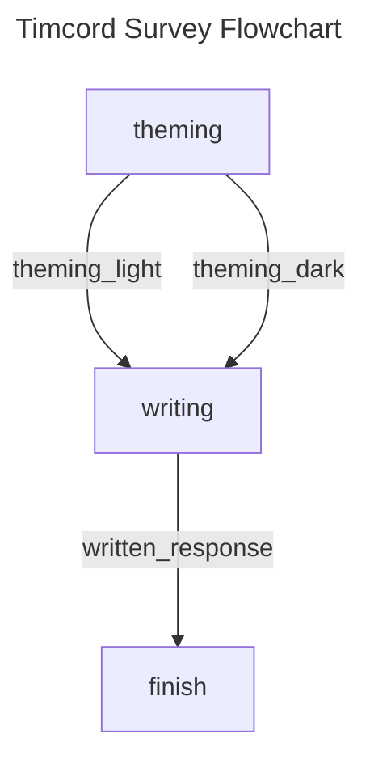
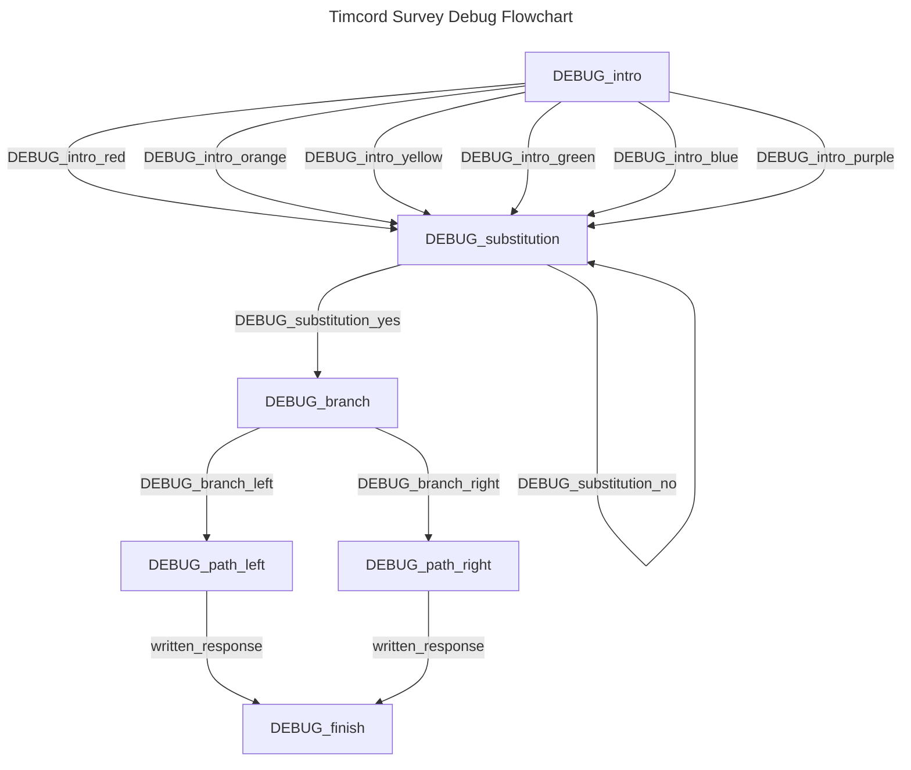

# Timcord Survey

## Information

This is a survey meant for the members of Timcord, inspired by the analysis work of W\[DATA EXPUNGED]k (those who know). It is currently in alpha.

## To Do

* [x] Multiple-Choice Questions
* [x] Recursive Questions (e.g. donut loop)
* [x] Branching Paths
* [ ] Written Response Questions
* [ ] [Dunkey Captcha Video](https://www.youtube.com/watch?v=WqnXp6Saa8Y)-Style Questions
* [ ] Pizza Tower Lap 2

## Flowchart

## Debug Flowchart

## Contributing

WHAT

HELP ME

GEGAGEDIGEDAGEDAGO
